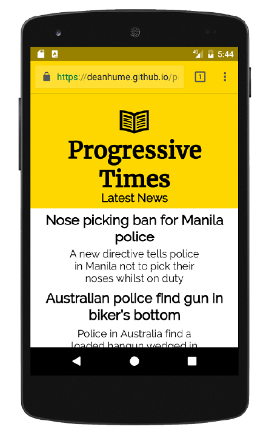

## 5.1 Web 应用清单

Web 应用清单文件是简单的 JSON 文件，它在文本文件中提供了应用相关的有用信息 (比如应用的名称、作者、图标和描述)。但更特别的是，Web 应用清单可使用户将 Web 应用安装到设备的主屏幕上，并允许开发者自定义启动画面、模板颜色，甚至是打开的 URL 。

但在开始这一切之前，还是先看代码！继续使用我们的示例应用 Progressive Times，并添加一个基础的 Web 应用清单文件 (或简称为 manifest.json 文件) 到应用中。

##### 代码清单 5.1

```json
{
  "name": "Progressive Times web app",
  "short_name": "Progressive Times",
  "start_url": "/index.html",
  "display": "standalone",
  "theme_color": "#FFDF00",
  "background_color": "#FFDF00",
  "icons": [{
      "src": "homescreen.png",
      "sizes": "192x192",
      "type": "image/png"
    },
    {
      "src": "homescreen-144.png",
      "sizes": "144x144",
      "type": "image/png"
    }
  ]
}
```

清单5.1中的代码是一个基础的 Web 应用清单，它告诉浏览器当前网站的大量信息。文件中的每个字段都有各自的作用，以告诉浏览器 PWA 的外观和感受应该是怎样的:

  * **name** 用作当用户被提示安装应用时出现的文本。
  * **short_name** 用作当应用安装后出现在用户主屏幕上的文本
  * **start_url** 决定了当用户从设备的主屏幕开启 Web 应用时所出现的第一个页面。本章稍后会详细介绍。
  * 根据构建的 Web 应用类型，你可能需要预设如何首次加载。**display** 字段表示开发者希望他们的 Web 应用如何向用户展示。本章稍后会详细介绍为什么这个字段如此重要。
  * 通过使用 **theme_color** 字段，可以对浏览器的地址栏进行着色，以符合网站的主色调。
  * **icons** 字段决定了当 Web 应用被添加到设备主屏幕时所显示的图标。

在我们进一步分解清单文件之前，先在我们的 Progressive Times 应用中引用它并看看它的外观。为了引用清单文件，你需要为 Web 应用的所有页面都添加 link 标签。清单5.2中的代码显示了在网页的 head 标签中使用 link 标签来引用 Web 应用的清单文件。

##### 代码清单 5.2

```html
<!DOCTYPE html>
<html>
  <head>
    <meta charset="UTF-8">
    <title>Progressive Times</title>
    <link rel="manifest" href="/manifest.json">  ❶
  </head>
  <body>
    ..content goes here..
  </body>
</html>
```

* ❶ 在网页的 head 标签中引用 Web 应用的清单文件

现在已经在示例应用中引用了清单文件，浏览器能够根据给定的信息决定如何进行运转。

在清单文件 (清单5.1中的代码) 中，我们告诉浏览器使用十六进制颜色 `#FFDF00` 作为整个网站的主题颜色。从图5.1中可以看出，地址栏的样式与我们选择的颜色已经很相称了。



**图5.1 Web 应用清单中的 theme_color 属性可用于为 Web 应用设置样式**

使用 Web 应用清单来为 Web 应用设置样式只是一小部分功能，Web 应用清单文件提供了大量的功能。让我们进一步了解一下如何使用 Web 应用清单文件来提供设备上的“添加到主屏幕”功能。